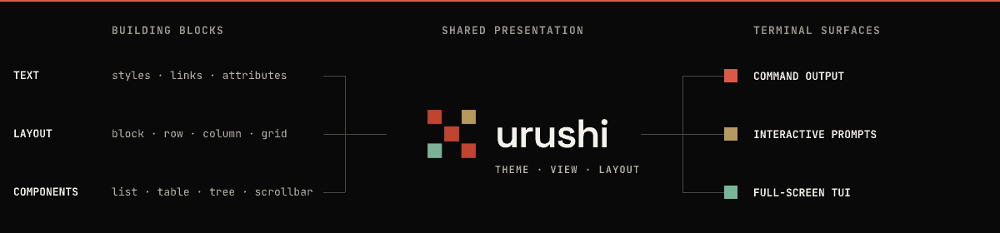
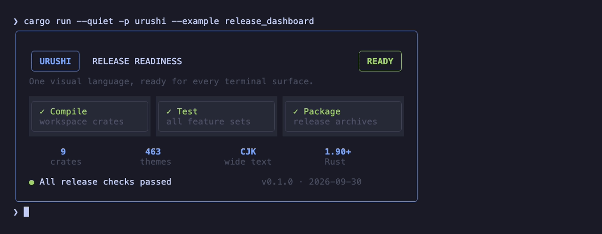
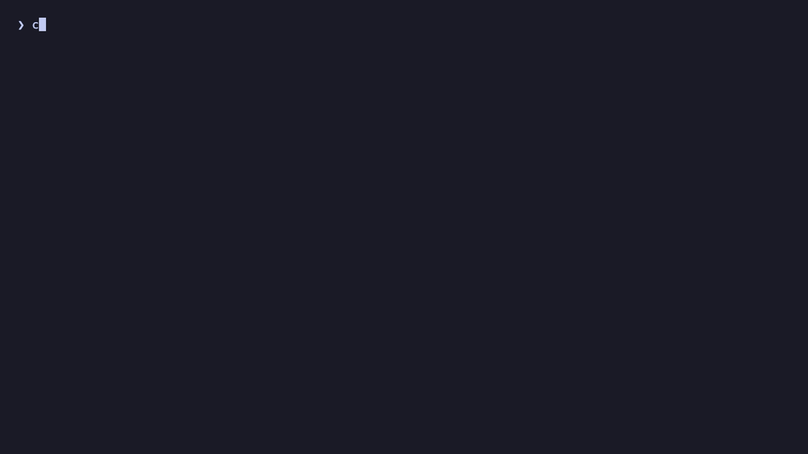
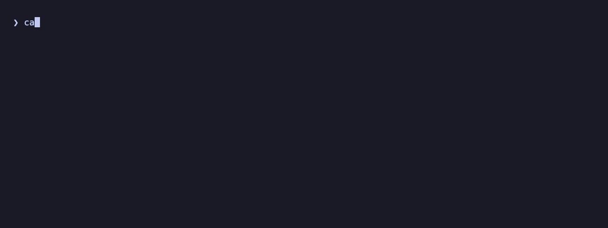

# Urushi

<p align="center"><strong>One visual language. Every terminal surface.</strong></p>

<p align="center">Composable styling, components, prompts, and terminal UI for Rust.</p>

<p align="center">
  <a href="https://urushi.choplin.dev/">Website</a> ·
  <a href="https://urushi.choplin.dev/docs/">Documentation</a> ·
  <a href="https://docs.rs/urushi">API reference</a>
</p>

<p align="center">
  <a href="https://crates.io/crates/urushi"></a>
  <a href="https://github.com/choplin/urushi/actions/workflows/ci.yml"></a>
  <a href="LICENSE-MIT"></a>
</p>

<p align="center">
  
</p>

Urushi gives command output, interactive prompts, and full-screen TUIs one
shared presentation foundation while each surface keeps its own interaction
and terminal lifecycle.

**Status:** Urushi 0.1.0 is in early development. Public APIs may change before
1.0.

## Why Urushi?

- **Keep one visual language.** Semantic themes, styles, components, and views
  can be reused across static output, prompts, and full-screen interfaces.
- **Use only the surface you need.** Write once to stdout, run a blocking form,
  let Urushi own a TEA-style application loop, or adapt a view to an existing
  Ratatui application.
- **Compose before rendering.** Renderer-neutral `View` values preserve layout
  and styling decisions until the target terminal surface is known.
- **Treat terminal width as UI geometry.** Layout, wrapping, borders, and
  alignment account for grapheme clusters and East Asian wide characters.

## Choose a terminal surface

Pick the interaction model your application needs. Themes, styles, components,
and renderer-neutral views remain shared across all three surfaces.

| Surface | What it gives you | Start with |
| --- | --- | --- |
| **Command output** | Composable layouts and semantic presentations that degrade safely when redirected | [`urushi`](https://urushi.choplin.dev/docs/cli/styled-output/) or [`urushi-cli`](https://urushi.choplin.dev/docs/cli/presentations/) |
| **Interactive prompts** | Typed input, validation, selection, and confirmation in a blocking session | [`urushi-prompt`](https://urushi.choplin.dev/docs/prompts/) |
| **Full-screen applications** | State, updates, effects, subscriptions, drawing, and terminal lifecycle | [`urushi-tui-app`](https://urushi.choplin.dev/docs/tui/runtime/) |

### Command output

Compose terminal-aware output without owning a UI loop.

- Semantic themes and reusable `View` composition
- Grapheme- and CJK-aware layout, wrapping, borders, and alignment
- ANSI capability detection and redirect-safe output

<p align="center">
  
</p>

<p align="center"><em>A representative release fixture rendered by the core crate; it does not report live CI results.</em></p>

### Interactive prompts

Collect structured input while Urushi manages a temporary terminal session.

- Typed fields with validation and error feedback
- Filtered selection and explicit confirmation
- Terminal restoration after completion or cancellation

<p align="center">
  
</p>

<p align="center"><em>The wizard produces a local plan only; it does not publish or change remote state.</em></p>

### Full-screen applications

Run stateful TUIs with a TEA-style application runtime.

- State, message, update, and view separation
- Asynchronous effects and event subscriptions
- Live redraw, restartable flows, and terminal restoration

<p align="center">
  
</p>

<p align="center"><em>The monitor uses simulated delayed effects; it does not read live CI state.</em></p>

### Other integration paths

| Requirement | Use |
| --- | --- |
| Own the input, timing, and terminal session | [`urushi-tui`](urushi-tui/) for a synchronous frame loop |
| Render inside an existing Ratatui application | [`urushi-adapter-ratatui`](https://urushi.choplin.dev/docs/tui/ratatui/) |
| Present Kitty or Sixel images with text fallback | [`urushi-graphics`](https://urushi.choplin.dev/docs/graphics/) |

[Choose by use case](https://urushi.choplin.dev/docs/use-cases/) maps each
surface to its dependency set and first task.

## Quickstart

Urushi 0.1.0 requires Rust 1.90 or newer. Create a small application and add
the core crate:

```sh
cargo new urushi-quickstart
cd urushi-quickstart
cargo add urushi
```

Replace `src/main.rs` with a bordered status view that writes to stdout:

```rust
use urushi::{BlockStyle, Border, Color, TextStyle, View};

fn status_view() -> View {
    let text = TextStyle::new()
        .foreground(Color::GREEN)
        .bold();

    let panel = BlockStyle::new()
        .border(Border::ROUNDED)
        .border_foreground(Color::BRIGHT_BLACK)
        .padding((0, 1));

    View::block(panel, View::text("Build complete", text))
}

fn main() -> std::io::Result<()> {
    urushi::println_view(&status_view())
}
```

Run the program:

```sh
cargo run
```

The result is a terminal-aware panel:

```text
╭────────────────╮
│ Build complete │
╰────────────────╯
```

On a capable terminal, the message is green and bold and the border is bright
black. When stdout is redirected, Urushi keeps the layout but omits ANSI
styling. `NO_COLOR=1` disables color without discarding other supported text
attributes.

For a guided explanation of this example, follow the
[quickstart](https://urushi.choplin.dev/docs/quickstart/).

## How the shared model works

Urushi shares presentation, not control flow:

```text
Theme → component presentation → View → layout → terminal surface
```

- A `Theme` gives semantic roles a consistent visual meaning.
- Components turn application data into renderer-neutral `View` values.
- One layout pass resolves the box model and terminal-cell geometry.
- The selected surface writes static output, runs a prompt, presents frames, or
  adapts cells to Ratatui.

This boundary lets a CLI summary, prompt, and TUI use the same theme without
pretending that they have the same interaction model. Read the
[presentation foundation](https://urushi.choplin.dev/docs/concepts/presentation-foundation/)
for the complete model.

## Run the examples

From a checkout of this repository, render a release dashboard that combines
semantic color, composition, panels, and terminal-aware layout:

```sh
cargo run -p urushi --example release_dashboard
```

Explore the complete style, layout, and component catalog:

```sh
cargo run -p urushi --example showcase
```

The CJK catalog exercises the same primitives with East Asian width and
alignment:

```sh
cargo run -p urushi --example cjk_showcase
```

Interactive, full-screen, and Ratatui examples require a real terminal:

```sh
cargo run -p urushi-prompt --example release_wizard
cargo run -p urushi-tui-app --example release_monitor
cargo run -p urushi-adapter-ratatui --example themed_ratatui
```

The release wizard demonstrates typed fields, validation, selection, and
terminal restoration. The release monitor demonstrates asynchronous effects,
state updates, live drawing, and restartable application flow. The Ratatui
example draws an Urushi view into an application-owned Ratatui buffer.

## Workspace crates

| Crate | Responsibility |
| --- | --- |
| [`urushi`](urushi/) | Styles, themes, components, renderer-neutral views, layout, static rendering policy, and standard-stream output. |
| [`urushi-cli`](urushi-cli/) | Opinionated presentations for human-facing, non-interactive CLI output. |
| [`urushi-prompt`](urushi-prompt/) | Typed input, selection, and confirmation forms with validation. |
| [`urushi-tui`](urushi-tui/) | Synchronous frames, cell buffers, diffing, and transactional terminal output. |
| [`urushi-tui-app`](urushi-tui-app/) | TEA-style applications, effects, subscriptions, scheduling, input, and terminal lifecycle. |
| [`urushi-adapter-ratatui`](urushi-adapter-ratatui/) | Stateless Urushi view and style adapters for caller-owned Ratatui buffers. |
| [`urushi-graphics`](urushi-graphics/) | Image components and Kitty/Sixel terminal graphics with text fallback. |
| [`urushi-terminal`](urushi-terminal/) | Shared terminal commands, ANSI encoding, events, geometry, capabilities, and session restoration. |
| [`urushi-derive`](urushi-derive/) | Derive macros used by typed Urushi components. |

All workspace crates in one release use the same version. Add only the crates
that correspond to the surfaces your application presents.

## Compatibility and limitations

- **Rust:** Urushi 0.1.0 requires Rust 1.90 or newer.
- **Platforms:** CI checks default and all-feature builds on Linux, macOS, and
  Windows, plus the complete feature graph with Rust 1.90.
- **Terminal capabilities:** Colors, attributes, hyperlinks, and graphics vary
  by terminal. Applications must not use decoration as the only carrier of
  meaning.
- **Version coordination:** Keep workspace crates on the same release version
  and review the changelog when upgrading.

See [Current limitations](https://urushi.choplin.dev/docs/reference/limitations/)
for the boundaries that affect prompt placement, low-level TUI ownership,
Ratatui integration, graphics lifecycles, and terminal capability handling.

## Documentation

- [Changelog](CHANGELOG.md)
- [Website](https://urushi.choplin.dev/)
- [API documentation](https://docs.rs/urushi)
- [Quickstart](https://urushi.choplin.dev/docs/quickstart/)
- [Choose by use case](https://urushi.choplin.dev/docs/use-cases/)
- [Crates and Cargo features](https://urushi.choplin.dev/docs/reference/crates/)
- [Current limitations](https://urushi.choplin.dev/docs/reference/limitations/)
- [Developer architecture](docs/architecture.md)

To work on the documentation site locally:

```sh
pnpm --dir website install --frozen-lockfile
pnpm --dir website dev
```

Use `pnpm --dir website build` for a production build. Documentation-site
changes deploy automatically after they reach `main`; see the [documentation
site design](docs/documentation-site.md) for the complete build, publishing,
and recovery contract.

## Acknowledgments

[Charm](https://charm.sh)'s libraries were among the references consulted in
developing Urushi. Thanks to the Charm team for their well-designed and
comprehensive suite of terminal UI libraries.

## License

Urushi is licensed under the [MIT License](LICENSE-MIT).
